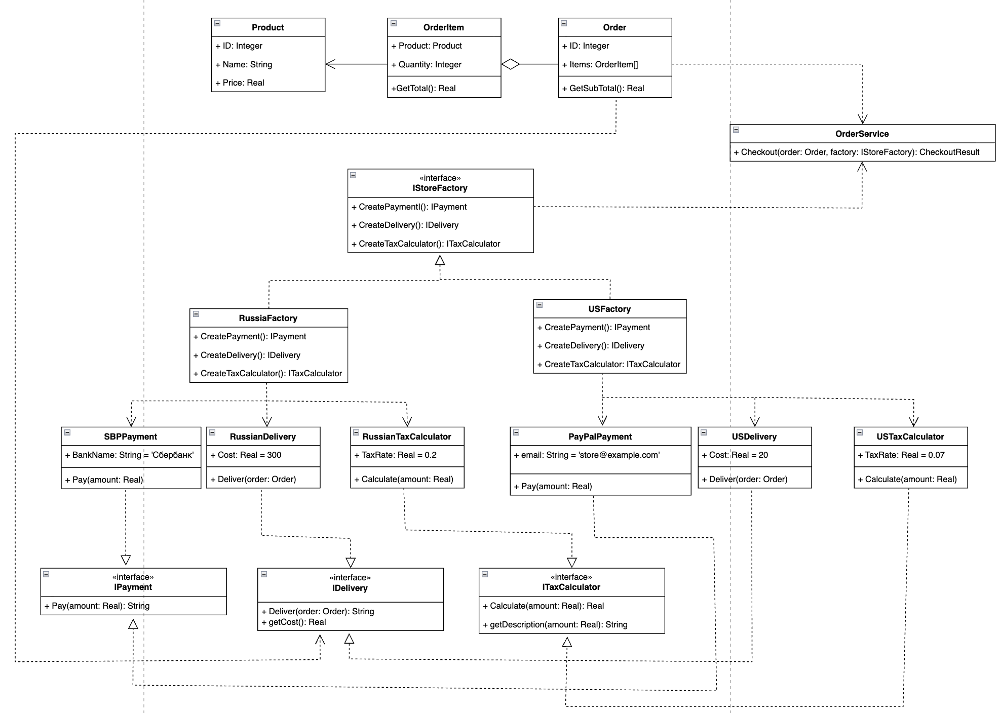
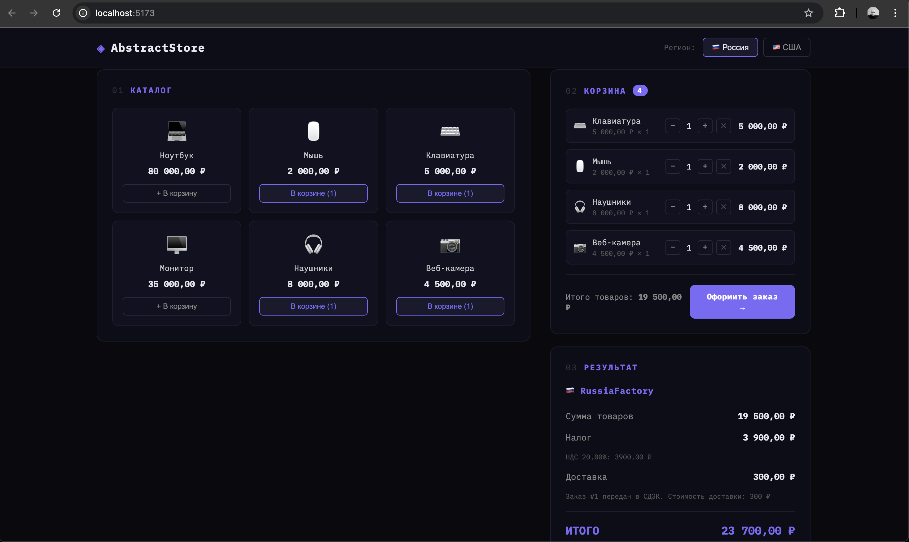

# Лабораторная работа №1 — Паттерн «Абстрактная фабрика»

## Предметная область

Интернет-магазин электроники **AbstractStore**, который работает в двух регионах — Россия и США. При оформлении заказа для каждого региона необходимо использовать свои механизмы оплаты, доставки и расчёта налогов:

| | Россия | США |
|---|---|---|
| Оплата | СБП (Сбербанк) | PayPal |
| Доставка | СДЭК, 300 ₽ | FedEx, $20 |
| Налог | НДС 20% | Sales Tax 7% |

Эти компоненты **связаны по регионам** — нельзя комбинировать российскую оплату с американской доставкой. Они образуют **семейства совместимых объектов**.

## Описание проблемы

В реализации без паттерна класс `OrderService` напрямую зависит от всех конкретных классов и содержит три дублирующихся `switch` по региону — для создания налогового калькулятора, доставки и оплаты:

```csharp
// Считаем налог
switch (region)
{
    case StoreRegion.Russia:
        var ruTax = new RussianTaxCalculator();
        tax = ruTax.Calculate(subTotal);
        break;
    case StoreRegion.USA:
        var usTax = new USTaxCalculator();
        tax = usTax.Calculate(subTotal);
        break;
}

// Выбираем доставку — ещё один switch...
// Проводим оплату — ещё один switch...
```

Проблемы такого подхода:

- **Нарушение Open/Closed Principle** — при добавлении нового региона (например, Казахстан) придётся менять `OrderService`, добавляя ветку в каждый из трёх `switch`-блоков.
- **Высокая связность** — `OrderService` знает обо всех конкретных классах всех регионов.
- **Дублирование логики выбора** — одна и та же проверка региона повторяется три раза.

## Решение: применение паттерна «Абстрактная фабрика»

### Интерфейсы продуктов

Для каждого компонента заказа определён интерфейс, описывающий общий контракт:

```csharp
public interface IPayment
{
    string Pay(decimal amount);
}

public interface IDelivery
{
    string Deliver(Order order);
    decimal GetCost();
}

public interface ITaxCalculator
{
    decimal Calculate(decimal amount);
    string GetDescription(decimal amount);
}
```

### Абстрактная фабрика

Интерфейс `IStoreFactory` объединяет создание всего семейства продуктов:

```csharp
public interface IStoreFactory
{
    IPayment CreatePayment();
    IDelivery CreateDelivery();
    ITaxCalculator CreateTaxCalculator();
}
```

### Конкретные фабрики

Каждая фабрика знает, какие продукты создавать для своего региона:

```csharp
public class RussiaFactory : IStoreFactory
{
    public IPayment CreatePayment() => new SBPPayment();
    public IDelivery CreateDelivery() => new RussianDelivery();
    public ITaxCalculator CreateTaxCalculator() => new RussianTaxCalculator();
}

public class USFactory : IStoreFactory
{
    public IPayment CreatePayment() => new PayPalPayment();
    public IDelivery CreateDelivery() => new USDelivery();
    public ITaxCalculator CreateTaxCalculator() => new USTaxCalculator();
}
```

### OrderService — клиент паттерна

`OrderService` работает исключительно через интерфейсы и не знает о конкретных реализациях:

```csharp
public CheckoutResult Checkout(Order order, IStoreFactory factory)
{
    var taxCalculator = factory.CreateTaxCalculator();
    var delivery = factory.CreateDelivery();
    var payment = factory.CreatePayment();
    // ... работа только через интерфейсы
}
```

### Выбор фабрики

Единственное место, где система знает о конкретных фабриках — контроллер:

```csharp
IStoreFactory factory = request.Region switch
{
    "Russia" => new RussiaFactory(),
    "USA"    => new USFactory(),
};
```

## Диаграмма классов

На рисунке 1 изображена диаграмма классов

Рисунок 1 - диаграмма классов


## Запуск

Бэкенд (из папки с `.csproj`):
```bash
dotnet run 
```

Фронтенд (из папки `store-ui`):
```bash
npm install
npm run dev
```
Приложение будет доступно по адресу `http://localhost:5173`.

## UI

Для фронтенда использовался React(Vite) + JS
На рисунке 2 изображен GUI магазина

Рисунок 2 - GUI

## Вывод

Внедрение паттерна «Абстрактная фабрика» позволило:

1. **Устранить дублирование** — вместо трёх `switch`-блоков в `OrderService` выбор региона происходит один раз при создании фабрики в контроллере.

2. **Снизить связность** — `OrderService` больше не зависит от конкретных классов. Он работает только через интерфейсы `IPayment`, `IDelivery`, `ITaxCalculator` и не знает, какой именно регион обслуживает.

3. **Соблюсти Open/Closed Principle** — для добавления нового региона достаточно создать новую фабрику и три класса продуктов. Существующий код (`OrderService`, другие фабрики) изменять не требуется.

4. **Гарантировать совместимость продуктов** — фабрика создаёт целое семейство объектов, поэтому невозможно случайно скомбинировать российскую оплату с американской доставкой.

