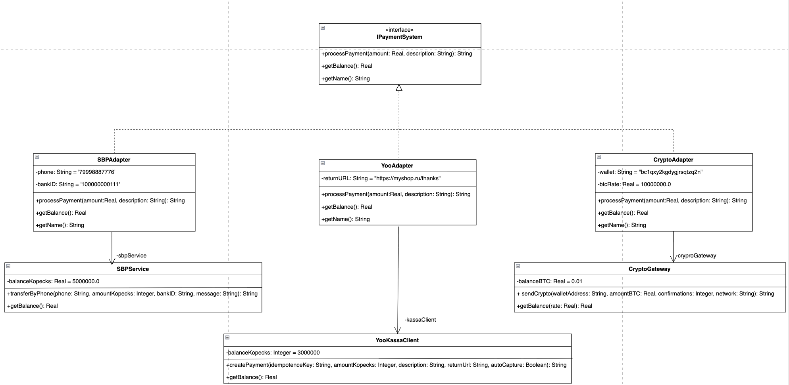

# Лабораторная работа №2 — Паттерн «Адаптер»

## Предметная область

Платёжная система, которая должна поддерживать оплату через несколько сервисов: **СБП** (Система быстрых платежей), **ЮKassa** и **криптовалюту (BTC)**. У каждого сервиса свой SDK с уникальным, несовместимым интерфейсом.

Начальные балансы на счетах:

| Система | Баланс |
|---|---|
| СБП | 50 000 ₽ |
| ЮKassa | 30 000 ₽ |
| Crypto | 0.01 BTC (≈ 100 000 ₽) |

При оплате деньги реально списываются со счетов, остатки выводятся в консоль сервера. Поддерживается одновременное списание со всех систем.

## Описание проблемы

Каждый платёжный сервис предоставляет свой SDK с полностью различающимся API:

**СБП** — метод `transferByPhone`, принимает номер телефона, сумму в копейках (`Integer`), ID банка и сообщение. Четыре параметра, сумма в копейках.

**ЮKassa** — метод `createPayment`, принимает ключ идемпотентности, сумму в копейках (`Integer`), описание, URL возврата и флаг автосписания. Пять параметров, сумма в копейках.

**Крипто** — метод `sendCrypto`, принимает адрес кошелька, сумму в BTC (`Real`), количество подтверждений и сеть. Четыре параметра, сумма в биткоинах.

Несовместимость SDK:

| Что различается | СБП | ЮKassa | Crypto |
|---|---|---|---|
| Название метода | `transferByPhone` | `createPayment` | `sendCrypto` |
| Формат суммы | копейки (`Integer`) | копейки (`Integer`) | BTC (`Real`) |
| Кол-во параметров | 4 | 5 | 4 |
| Доп. параметры | телефон, банк | ключ, URL, capture | кошелёк, сеть |

Менять чужие SDK нельзя — это сторонний код. Менять свой интерфейс из-за каждого нового сервиса — нерационально.

В реализации без паттерна класс `PaymentService` напрямую зависит от всех трёх SDK, содержит объекты и параметры каждого из них, и использует `switch` для выбора нужного сервиса. При добавлении четвёртого сервиса нужно менять этот класс — нарушается Open/Closed Principle.

## Решение: применение паттерна «Адаптер»

### Единый интерфейс (Target)

Программа работает через один интерфейс с простыми методами:

```cpp
class IPaymentSystem {
public:
    virtual std::string processPayment(double amount, const std::string& description) = 0;
    virtual double getBalance() const = 0;
    virtual std::string getName() const = 0;
    virtual ~IPaymentSystem() = default;
};
```

Два параметра — сумма в рублях и описание. Программа не знает ни про какие копейки, биткоины, телефоны и кошельки.

### Адаптеры

Каждый адаптер реализует `IPaymentSystem`, содержит внутри экземпляр чужого SDK и преобразует вызов:

**SbpAdapter** — конвертирует рубли в копейки, подставляет номер телефона и ID банка, вызывает `sbpService.transferByPhone()`:

```cpp
class SbpAdapter : public IPaymentSystem {
private:
    SbpService sbpService;
    std::string phone = "+79998887776";
    std::string bankId = "100000000111";
public:
    std::string processPayment(double amount, const std::string& description) override {
        long kopecks = static_cast<long>(amount * 100);
        return sbpService.transferByPhone(phone, kopecks, bankId, description);
    }
};
```

**YooKassaAdapter** — конвертирует рубли в копейки, генерирует ключ идемпотентности, подставляет URL возврата и флаг автосписания, вызывает `kassaClient.createPayment()`.

**CryptoAdapter** — конвертирует рубли в BTC по курсу, подставляет адрес кошелька, количество подтверждений и сеть, вызывает `cryptoGateway.sendCrypto()`.

### Использование единого интерфейса

Программа работает через массив `IPaymentSystem*` и не знает, какой SDK за каждым адаптером:

```cpp
std::vector<std::shared_ptr<IPaymentSystem>> allPayments = {sbp, kassa, crypto};

// Оплата со всех систем — один цикл, один интерфейс
for (auto& payment : allPayments) {
    payment->processPayment(share, description);
}
```

Программе всё равно что внутри — СБП, ЮKassa или крипта. Она вызывает `processPayment(amount, description)` и получает результат.

## Диаграмма классов

Диаграмма классов для архитектуры с паттерном:


## Запуск

Бэкенд (из папки с `.cpp` и `httplib.h`):
```bash
g++ -std=c++17 -o server with_pattern.cpp
./server
```
В консоли появится: `Сервер запущен на http://localhost:8080`

Фронтенд (из папки `frontend`):
```bash
npm install
npm run dev
```

Приложение доступно по адресу `http://localhost:5173`.

Для переключения на версию без паттерна — остановить сервер (`Ctrl+C`) и запустить:
```bash
g++ -std=c++17 -o server without_pattern.cpp
./server
```

## Вывод

Внедрение паттерна «Адаптер» позволило:

1. **Привести несовместимые интерфейсы к единому виду** — три SDK с разными методами, типами данных и параметрами теперь работают через один интерфейс `IPaymentSystem.processPayment(amount, description)`.

2. **Устранить прямые зависимости** — программа не знает ни про `SbpService`, ни про `YooKassaClient`, ни про `CryptoGateway`. Она работает только через `IPaymentSystem`.

3. **Соблюсти Open/Closed Principle** — для добавления нового платёжного сервиса достаточно создать один новый адаптер. Существующий код не меняется.

4. **Обеспечить работу через единый цикл** — кнопка «Списать со всех» проходит по массиву `IPaymentSystem*` и вызывает `processPayment()` у каждого. Без паттерна для этого пришлось бы вручную вызывать каждый SDK с его уникальными параметрами.

5. **Инкапсулировать преобразование данных** — конвертация рублей в копейки, рублей в BTC, генерация ключей идемпотентности и подстановка параметров скрыты внутри адаптеров. Программа передаёт рубли — адаптер сам разбирается что с ними делать.