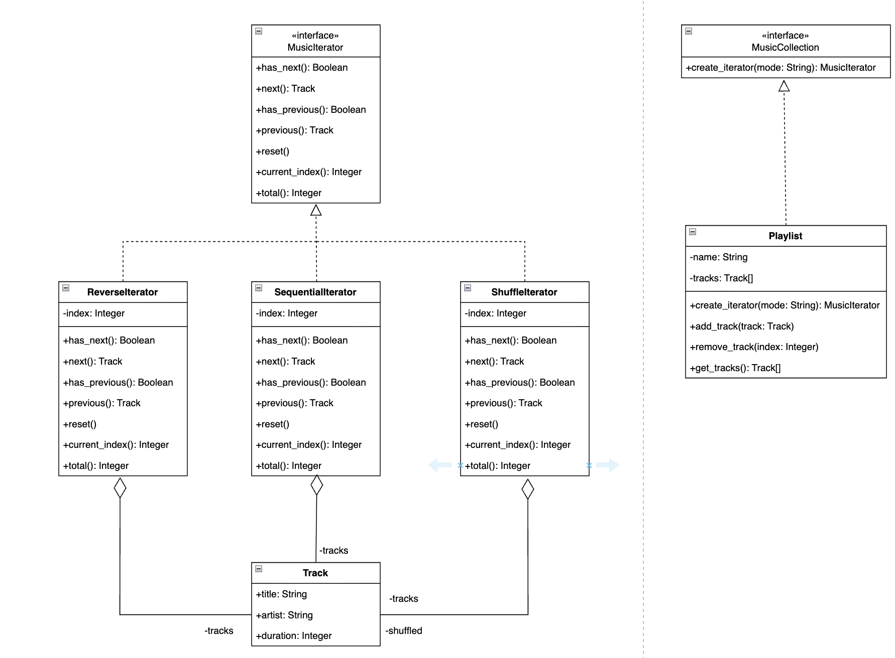

# Лабораторная работа №3 — Паттерн Iterator

## Предметная область: Музыкальный плеер

### 1. Описание проблемы

Музыкальный плеер работает с плейлистом — коллекцией треков, по которой пользователь перемещается кнопками Next и Previous. При этом существует несколько режимов воспроизведения: последовательный, обратный и случайный (shuffle).

Без применения паттерна вся логика навигации размещается внутри класса `Playlist`. Каждый метод навигации (`next`, `previous`, `has_next`, `has_previous`, `reset`) содержит условные конструкции `if/elif`, проверяющие текущий режим воспроизведения:

```python
def next(self):
    if self._mode == "reverse":
        if self._index > 0:
            self._index -= 1
    else:
        if self._index < len(self._active_list()) - 1:
            self._index += 1
    return self._active_list()[self._index]
```

Это приводит к нескольким проблемам:
- **Нарушение принципа единственной ответственности** — класс `Playlist` одновременно отвечает за хранение треков и за логику обхода в разных режимах.
- **OCP** — добавление нового режима воспроизведения (например, зацикленного) требует модификации каждого метода навигации.

### 2. Решение: паттерн Iterator

Паттерн Iterator выносит логику обхода коллекции в отдельные объекты — итераторы. Каждый итератор инкапсулирует свой способ навигации и хранит собственное состояние (текущую позицию).

#### Структура проекта

Определён интерфейс `MusicIterator` с методами:
- `has_next(): Boolean` — есть ли следующий трек
- `next(): Track` — перейти к следующему
- `has_previous(): Boolean` — есть ли предыдущий трек
- `previous(): Track` — перейти к предыдущему
- `reset()` — сбросить позицию
- `current_index(): Integer` — текущий индекс
- `total(): Integer` — общее количество треков
- `current(): Track` — получить текущий трек

Три конкретных итератора реализуют этот интерфейс:

| Итератор | Поведение |
|---|---|
| `SequentialIterator` | Обход от первого трека к последнему (1-2-3-4-5) |
| `ReverseIterator` | Обход от последнего к первому (5-4-3-2-1) |
| `ShuffleIterator` | Обход в случайном порядке, при reset перемешивается заново |

Интерфейс `MusicCollection` определяет метод `create_iterator(mode: String): MusicIterator`. Класс `Playlist` реализует этот интерфейс и создаёт нужный итератор по строке режима:

```python
def create_iterator(self, mode: str) -> MusicIterator:
    if mode == "sequential":
        return SequentialIterator(self._tracks)
    elif mode == "reverse":
        return ReverseIterator(self._tracks)
    elif mode == "shuffle":
        return ShuffleIterator(self._tracks)
```

### 3. Диаграмма классов


### 4. Вывод

Внедрение паттерна Iterator повлияло на проект следующим образом:

**Разделение ответственностей.** Класс `Playlist` отвечает только за хранение и управление треками (`add_track`, `remove_track`, `get_tracks`). Логика навигации полностью вынесена в итераторы. Каждый итератор — небольшой изолированный класс, делающий одну вещь.

**Расширяемость.** Добавление нового режима воспроизведения сводится к созданию нового класса, реализующего `MusicIterator`, и добавлению одной строки в `create_iterator`. Существующий код не модифицируется, что соответствует принципу OCP.

**Единый интерфейс.** Благодаря абстрактному интерфейсу `MusicIterator` клиентский код (GUI, API) работает одинаково с любым итератором. Переключение режима — это просто замена одного объекта-итератора на другой.
