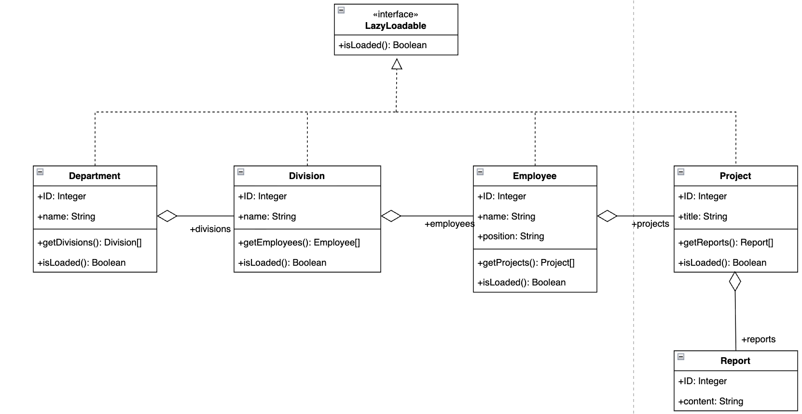

# Паттерн Lazy Load — Корпоративная структура компании

## 1. Описание проблемы

Предметная область — корпоративная структура компании с глубокой иерархией:

**Департамент → Отдел → Сотрудник → Проект → Отчёт**

При классическом подходе (Eager Load) система загружает всё дерево целиком при каждом обращении к данным. Это создаёт серьёзные проблемы:

- **Избыточная нагрузка на БД** — если пользователю нужен только список департаментов, система всё равно загружает всех сотрудников, все проекты и все отчёты
- **Медленный отклик** — чем больше данных в компании, тем дольше ждёт пользователь
- **Лишние запросы** — при каждом обращении к API выполняются 5 вложенных уровней SQL-запросов, даже если нужен только первый уровень

## 2. Решение: Lazy Load в проекте

Паттерн **Lazy Load** (ленивая загрузка) решает проблему — данные загружаются только в тот момент, когда они реально нужны.

### Интерфейс LazyLoadable

Все сущности реализуют общий интерфейс, который позволяет проверить — загружены ли дочерние данные объекта:

```java
interface LazyLoadable {
    boolean isLoaded();
}
```

### Классы данных

Каждый класс хранит дочерние данные как `null` по умолчанию. Загрузка происходит только при первом обращении:

```java
class Department implements LazyLoadable {
    public long id;
    public String name;
    public List<Division> divisions = null; // не загружено

    public List<Division> getDivisions(DataLoader loader) {
        if (divisions == null)
            divisions = loader.loadDivisions(this.id); // идём в БД только сейчас
        return divisions;
    }

    public boolean isLoaded() { return divisions != null; }
}
```

### DataLoader

Отдельный класс, который отвечает за загрузку каждого уровня иерархии из базы данных. Каждый метод загружает ровно один уровень:

```
loadDepartments()         — все департаменты
loadDivisions(deptId)     — отделы конкретного департамента
loadEmployees(divId)      — сотрудники конкретного отдела
loadProjects(empId)       — проекты конкретного сотрудника
loadReports(projId)       — отчёты конкретного проекта
```

### API эндпоинты

Вместо одного большого эндпоинта — отдельный эндпоинт для каждого уровня:

```
GET /api/lazy/departments
GET /api/lazy/departments/{id}/divisions
GET /api/lazy/divisions/{id}/employees
GET /api/lazy/employees/{id}/projects
GET /api/lazy/projects/{id}/reports
```

Фронтенд запрашивает следующий уровень только когда пользователь раскрывает узел дерева.



## 3. Вывод

Внедрение паттерна Lazy Load повлияло на работу программы следующим образом:

**Плюсы:**

- Количество запросов к БД при открытии страницы сократилось с 5 уровней вложенных запросов до 1 — загружаются только департаменты
- Система не тратит ресурсы на данные, которые пользователь не запросил
- Каждый уровень загружается ровно один раз и кешируется в памяти объекта — повторные обращения не идут в БД

**Минусы:**

- Если нужны все данные сразу — Lazy Load проигрывает Eager Load, так как требует несколько последовательных запросов вместо одного
- Код усложняется: появляются дополнительный интерфейс `LazyLoadable`, класс `DataLoader` и раздельные эндпоинты

**Итог:** паттерн эффективен в сценариях, где пользователь работает с частью иерархии, а не с полным деревом. Для корпоративной структуры с большим количеством данных это типичный случай — администратор чаще смотрит конкретный отдел, чем всю компанию целиком.